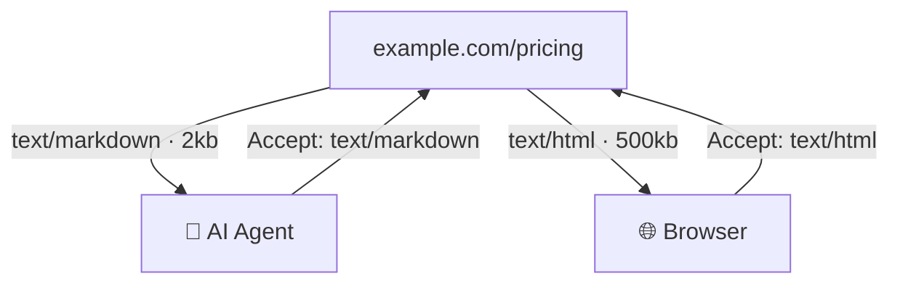
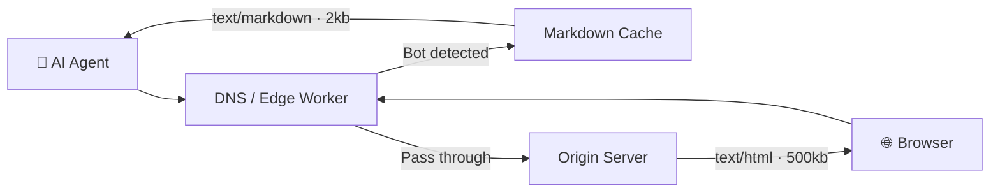

The web has had one user for 30 years: humans. That's changing.

[GPTBot makes 569 million requests per month. ClaudeBot makes 370 million.](https://blog.cloudflare.com/from-googlebot-to-gptbot-whos-crawling-your-site-in-2025/) PerplexityBot, Google-Extended, ByteSpider, Meta-ExternalAgent, the list grows every quarter. AI agents are crawling the web at a scale that will soon surpass human browsing.

But here's the problem: they're consuming a web that was never built for them.

## What AI Agents Actually See

When GPTBot hits your website, it gets the same 500kb HTML response a Chrome browser gets. Except it can't run JavaScript. It doesn't render CSS. It doesn't see your carefully designed layout or your interactive components.

It sees this:

```html
<!DOCTYPE html>
<html lang="en">
  <head>
    <meta charset="utf-8" />
    <meta name="viewport" content="width=device-width" />
    <script src="/_next/static/chunks/webpack-5e156.js"></script>
    <script src="/_next/static/chunks/framework-3b5a.js"></script>
    <script src="/_next/static/chunks/main-app-6c82.js"></script>
    <!-- 47 more script tags -->
    <link rel="stylesheet" href="/_next/static/css/app-layout-9f3d.css" />
    <!-- 12 more stylesheets -->
  </head>
  <body>
    <div id="__next"></div>
    <script>
      self.__next_f.push([1, "..."]);
    </script>
    <!-- 200+ lines of serialized React Server Component payload -->
  </body>
</html>
```

For a JavaScript-rendered site, the actual content isn't even in the HTML. It's behind a hydration boundary. The bot gets an empty `<div>` and a pile of JavaScript it can't execute.

Even for server-rendered sites, the signal-to-noise ratio is terrible. Navigation menus, footer links, cookie banners, tracking scripts, SVG icons, ad containers all of it gets ingested as tokens by the AI model trying to understand your pricing page.

The same page as markdown:

```markdown
# Pricing

## Starter — $29/mo

- 10,000 API calls
- 5 team members
- Email support

## Pro — $99/mo

- 100,000 API calls
- Unlimited team members
- Priority support
- Custom integrations

## Enterprise — Custom

Contact sales for volume pricing and SLA guarantees.
```

500kb of HTML becomes 2kb of markdown. Every token is signal. Zero noise.

## The Industry Is Waking Up to This

This isn't a theoretical problem. The market is moving fast.

[**Vercel's CEO demonstrated it publicly.**](https://x.com/rauchg/status/2016955207876563217) Guillermo Rauch showed that `vercel.com/changelog` serves markdown when an agent requests it with `Accept: text/markdown`. Same URL, different response based on who's asking. A 500kb page drops to 2kb. Standard HTTP content negotiation no infrastructure changes needed.

```bash
curl -L -H 'accept: text/markdown' https://vercel.com/docs
```

[**Parallel Web Systems raised $100M**](https://parallel.ai/blog/series-a) to build web infrastructure specifically for AI agents. Founded by former Twitter CEO Parag Agrawal, their thesis is that AIs will use the web far more than humans ever have, and the infrastructure needs to be rebuilt from the ground up for machine consumption.

**The [`llms.txt`](https://scalemath.com/blog/llms-txt/) standard is gaining traction.** Over thousands of sites, including [Vercel](https://vercel.com/llms.txt), [Stripe](https://stripe.com/llms.txt), [Cloudflare](https://developers.cloudflare.com/llms-full.txt), and [Zapier](https://docs.zapier.com/llms.txt), now serve an `llms.txt` file that gives AI models a structured map of their content. Think of it as `robots.txt` for the AI era.

**YC is funding GEO startups aggressively.** [Relixir (X25)](https://www.workatastartup.com/companies/relixir) and [AthenaHQ (W25)](https://www.ycombinator.com/companies/athenahq) both focus on Generative Engine Optimization, making sure your brand gets cited when someone asks ChatGPT or Perplexity a question about your space.

And the numbers back it up:

- [Gartner predicts](https://www.gartner.com/en/newsroom/press-releases/2024-02-19-gartner-predicts-search-engine-volume-will-drop-25-percent-by-2026-due-to-ai-chatbots-and-other-virtual-agents) a 50% drop in traditional organic traffic by 2028 from AI search
- [AI tool traffic grew 80% year-over-year](https://onelittleweb.com/data-studies/ai-chatbots-vs-search-engines/), reaching 55 billion visits
- [Apple's SVP Eddy Cue confirmed](https://fortune.com/2025/05/08/apple-eddy-cue-testimony-google-alphabet-safari-ai-search-features/) Safari had its first decline in search queries in 22 years

The web isn't dying. But the way content gets consumed is fundamentally changing.

## Two Audiences, One URL

The web is splitting into two parallel layers:

**The Human Web**: HTML, CSS, JavaScript. Visual layouts, interactive components, animations, video embeds. Optimized for eyes and clicks.

**The Machine Web**: Clean text, structured data, markdown. Tables, hierarchies, code blocks. Optimized for parsing and reasoning.

Both layers serve the same content. But the format is radically different.

The question for every website owner is: are you serving both layers, or just one?

If you're only serving HTML, then when GPTBot crawls your site, it's trying to extract signal from noise. When a user asks ChatGPT "what does [your company] charge for their pro plan?", the AI might get it wrong. Not because your pricing page doesn't exist, but because it's buried in 500kb of markup that's hard to parse.

## How Content Negotiation Works

The solution is already a web standard. [HTTP content negotiation](https://datatracker.ietf.org/doc/html/rfc7231#section-5.3) (RFC 7231) lets clients tell servers what format they prefer using the `Accept` header.

When a browser requests a page:

```
Accept: text/html,application/xhtml+xml
```

When an AI agent requests the same page:

```
Accept: text/markdown
```

The server checks the header and responds accordingly. Same URL. Same content. Different format.

```
GET /pricing HTTP/1.1
Host: example.com
Accept: text/markdown

HTTP/1.1 200 OK
Content-Type: text/markdown; charset=utf-8

# Pricing
...
```

This is how Vercel does it. This is how [Mintlify](https://mintlify.com/) and [Fumadocs](https://fumadocs.vercel.app/) do it for documentation sites. [Bun popularized it](https://x.com/bunjavascript/status/1971934734940098971) when they started serving markdown to Claude Code.

No proxy. No DNS change. No infrastructure overhaul. The origin server itself decides what to serve.

## The Problem: 95% of Websites Can't Do This

Content negotiation is technically elegant. But it requires the origin server to support it. That means:

- Modifying server-side code to detect `Accept` headers or bot User-Agents
- Generating a markdown version of every page
- Keeping markdown in sync when content changes
- Handling edge cases (dynamic content, authenticated pages, A/B tests)

For a team running Next.js on Vercel, this is a middleware addition. For the [43% of the web running WordPress](https://w3techs.com/technologies/details/cm-wordpress), the millions of sites on Drupal, Joomla, raw PHP, or static HTML on shared hosting from 2012, it's just not realistic.

These sites don't have a build pipeline. They don't have a deployment process. Many don't have developers on staff. But they have content that AI agents are already trying to consume, and consuming badly.

## The Hard Problem: Generating AI-Ready Content at Scale

Serving markdown is the easy part. Creating high-quality, structured markdown from arbitrary websites is the hard part.

A real content extraction pipeline needs to:

1. **Render JavaScript.** Many sites are SPAs or use client-side rendering. You need a headless browser (Playwright, Puppeteer) to get the actual content.

2. **Extract signal from noise.** Strip navigation, footers, sidebars, ads, cookie banners. Keep the actual content. This requires multiple extraction strategies, tools like [Trafilatura](https://trafilatura.readthedocs.io/) for precision, [Readability](https://github.com/mozilla/readability) for recall, with quality scoring to pick the best output.

3. **Preserve structure.** Tables, code blocks, image alt text, heading hierarchies, internal links. A flat text dump loses critical information. The markdown needs to be semantically rich.

4. **Handle scale.** A single website might have thousands of pages. You need concurrent crawling, sitemap parsing, BFS discovery, and deduplication.

5. **Stay fresh.** Content changes. Pricing updates, blog posts publish, products launch. Stale markdown is worse than no markdown because it gives AI agents wrong answers with high confidence.

6. **Respect boundaries.** `robots.txt`, rate limits, authentication walls. Not every page should be in the AI-readable version.

This is not a weekend project. It's a genuine infrastructure challenge.

## What Good AI-Ready Content Looks Like

Here's what an AI agent needs versus what it gets from raw HTML.

**What it gets (raw HTML, truncated):**

```html
<div class="pricing-container mx-auto max-w-7xl px-6 lg:px-8">
  <div class="pricing-header text-center">
    <h2 class="text-3xl font-bold tracking-tight text-gray-900 sm:text-4xl">
      Simple, transparent pricing
    </h2>
    <p class="mt-6 text-lg leading-8 text-gray-600">
      Choose the plan that's right for your team.
    </p>
  </div>
  <div
    class="isolate mx-auto mt-10 grid max-w-md grid-cols-1 gap-8 lg:max-w-4xl lg:grid-cols-3"
  >
    <div class="rounded-3xl p-8 ring-1 ring-gray-200 xl:p-10">
      <div class="flex items-center justify-between gap-x-4">
        <h3
          id="tier-starter"
          class="text-lg font-semibold leading-8 text-gray-900"
        >
          Starter
        </h3>
      </div>
      <p class="mt-4 text-sm leading-6 text-gray-600">
        Perfect for small teams getting started.
      </p>
      <p class="mt-6 flex items-baseline gap-x-1">
        <span class="text-4xl font-bold tracking-tight text-gray-900">$29</span>
        <span class="text-sm font-semibold leading-6 text-gray-600"
          >/month</span
        >
      </p>
      <!-- 200 more lines of markup for features, buttons, tooltips... -->
    </div>
  </div>
</div>
```

**What it should get (markdown):**

```markdown
# Pricing

Simple, transparent pricing. Choose the plan that's right for your team.

|                     | Starter | Pro       | Enterprise |
| ------------------- | ------- | --------- | ---------- |
| Price               | $29/mo  | $99/mo    | Custom     |
| API calls           | 10,000  | 100,000   | Unlimited  |
| Team members        | 5       | Unlimited | Unlimited  |
| Support             | Email   | Priority  | Dedicated  |
| Custom integrations | No      | Yes       | Yes        |
| SLA                 | No      | No        | Yes        |

All plans include 14-day free trial. No credit card required.
```

The markdown version is 15x smaller, 100% parseable, and contains every fact from the original page. When an AI agent ingests this, it can answer "how much does the Pro plan cost?" or "do they offer SLAs?" with perfect accuracy.

## The Two Delivery Models

Once you have AI-ready markdown, there are two ways to get it to the agents:

### Model 1: Origin-side delivery (Content Negotiation)

The website itself detects AI agents and serves markdown. Works for sites that can add middleware: Next.js, Express, Rails, Django, or any framework with request interceptors.



Pros: No third party involved. No DNS change. No proxy. No latency overhead.
Cons: Requires server-side changes. Requires the site to generate and host markdown. Not feasible for legacy sites.

### Model 2: Edge delivery (DNS-level)

A third-party service sits between the domain and the origin, intercepts bot requests, and serves markdown from a cache. Human traffic passes through to the origin unchanged.



Pros: Works for any website. No code changes. One DNS record.
Cons: All traffic flows through a third party. Origin must still accept proxied requests. Adds operational complexity and a dependency.

### The Hybrid Future

In practice, the web will use both models:

- Modern sites on Vercel, Netlify, Cloudflare Pages will adopt content negotiation natively. It's a middleware addition.
- Legacy sites, static sites, and sites without developer resources will need edge delivery or a plugin
- [WordPress sites (43% of the web)](https://w3techs.com/technologies/details/cm-wordpress) will get there through a plugin ecosystem
- Enterprise sites will want control and will likely self-host the markdown generation

The tooling that wins will be the one that handles content generation well, regardless of which delivery model the customer uses.

## What This Means for Developers

If you're building a website today:

1. **Add `Accept: text/markdown` support.** Check the Accept header. If the client wants markdown, serve it. Vercel has a [Next.js template](https://vercel.com/templates/next.js/markdown-to-agents-html-to-humans) for this.

2. **Create an `llms.txt` file.** Even a basic one that links to your key pages in markdown format. It's low effort, and [thousands of sites already do this](https://llms-txt.io/).

3. **Test what AI agents see.** Run `curl -A "GPTBot" https://yoursite.com/` and look at the response. Is your content actually in the HTML, or is it behind JavaScript? If it's behind JS, AI agents see an empty page.

4. **Structure your content.** Use proper HTML semantics: `<table>` for tabular data, `<h1>`-`<h6>` for hierarchy, `<code>` for code blocks. Even without markdown delivery, well-structured HTML is easier for AI to parse.

5. **Monitor AI bot traffic.** Check your access logs for GPTBot, ClaudeBot, PerplexityBot. You might be surprised how much AI traffic you already get, and how poorly you're serving it.

If you're building tools for this space:

The content generation pipeline (scraping, rendering, extracting, structuring, keeping fresh) is the hard problem. The delivery layer is converging on standards like content negotiation and llms.txt. Build the engine that creates high-quality markdown from any website, and let the delivery be flexible.

## The Web for Machines

The web was built for human eyes. HTML was a document format for visual rendering. CSS made it pretty. JavaScript made it interactive. We spent three decades optimizing for how humans consume information on screens.

Now we need a parallel layer. Same content, different format. Optimized for parsing, not rendering. For tokens, not pixels. For reasoning, not clicking.

This isn't replacing the human web. It's adding a machine-readable layer on top of it. The same URL serves both audiences. The content is identical. Only the packaging changes.

The sites that do this well will be the ones AI agents cite. The ones that don't will be invisible to the fastest-growing consumer of web content in history.

The web is splitting in two. Both halves need to work.
