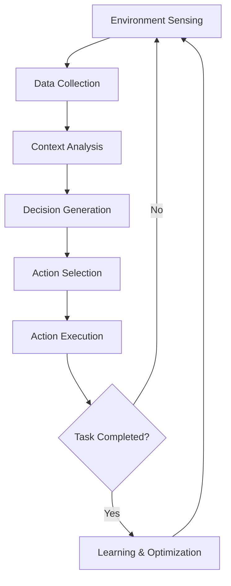

## Understanding AI Agents: Beyond Traditional AI Interactions

AI agents represent a revolutionary leap in artificial intelligence, transcending the limitations of traditional conversational AI by introducing autonomous decision-making and action-execution capabilities. Unlike static language models, these intelligent systems can dynamically interact with their environment, process real-time data, and perform complex tasks independently.

## Core Architecture of AI Agents

AI agents are sophisticated systems built on several critical technological foundations:

<Stepper>
  <StepperItem title="Perception Layer">
    - Advanced sensor integration and data collection mechanisms
   - Real-time environment scanning and contextual understanding
   - Multi-modal input processing (text, visual, auditory)
  </StepperItem>

  <StepperItem title="Decision-Making Engine">
    - Machine learning algorithms for intelligent reasoning 
    - Probabilistic decision trees and neural network-based inference
    - Contextual understanding and predictive analytics
  </StepperItem>

  <StepperItem title="Action Execution Framework">
    - Programmable function libraries
    - API integration capabilities
    - Secure and controlled interaction protocols
    - Distributed execution across multiple devices
    - Multi-agent coordination
  </StepperItem>

  <StepperItem title="Learning & Optimization">
    - Adaptive learning algorithms
    - Meta-learning techniques
    - Dynamic strategy refinement
    - Cross-domain functionality    
  </StepperItem>
</Stepper>

## Operational Workflow of AI Agents

## Advanced Capabilities in 2025:
<Stepper>
  <StepperItem title="Adaptive Learning">
    - Continuous improvement through interaction
    - Meta-learning techniques
    - Dynamic strategy refinement
  </StepperItem>
  <StepperItem title="Cross-Domain Functionality">
    - Seamless integration across multiple technological ecosystems
    - Contextual intelligence spanning different operational domains
  </StepperItem>
  <StepperItem title="Ethical Decision-Making">
    - Built-in governance frameworks
    - Transparent reasoning processes
    - Predefined ethical constraints
  </StepperItem>
</Stepper>

## Future Outlook

As we progress through 2025, AI agents are poised to become integral components of technological ecosystems, bridging the gap between artificial intelligence and practical, autonomous problem-solving.

**Key Trends:**
- Increased specialization in domain-specific agents
- Enhanced interpretability and explainable AI
- Collaborative multi-agent systems

<Note type="success" title="Key Takeaway">
The future of AI lies not in replacing human intelligence, but in creating symbiotic systems that amplify human capabilities.
</Note>

## Conclusion

AI agents represent more than a technological advancement—they symbolize a paradigm shift in how we conceptualize intelligence, interaction, and problem-solving in the digital age.